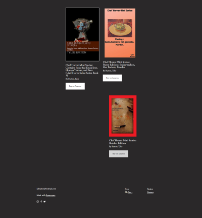
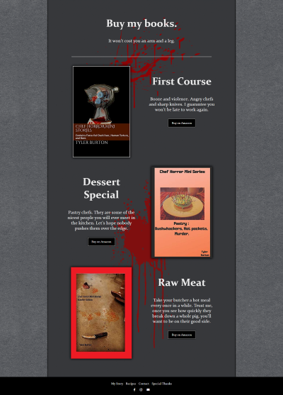

# The Chef Horror Mini Store

This site is for chef-author Tyler Burton, who writes short horror stories about restaurant workers and sells them on Amazon.

## Technology Stack

- HTML5
- CSS3

### A Note about Simplicity

I would have loved to add more features and complexity, but the client is extremely happy with the the end result, and does not wish to add any more features or content at this time.

## Description

The site's purpose is to create a theme-space for potential buyers to get a glimpse of the author's background and writing style to help produce more sales of his books.

The original site was made in squarespace by the author, but was buggy, and full of continuity and layout errors. I took the original wireframe and the content and re-wrote the entire site from scratch to be more unified and streamlined in order to present a better product to the end user.

Here you can see an example of the original site and then the updated version:

## Hosting

The current version of this site is hosted at https://chef-horror-mini-stories.com
